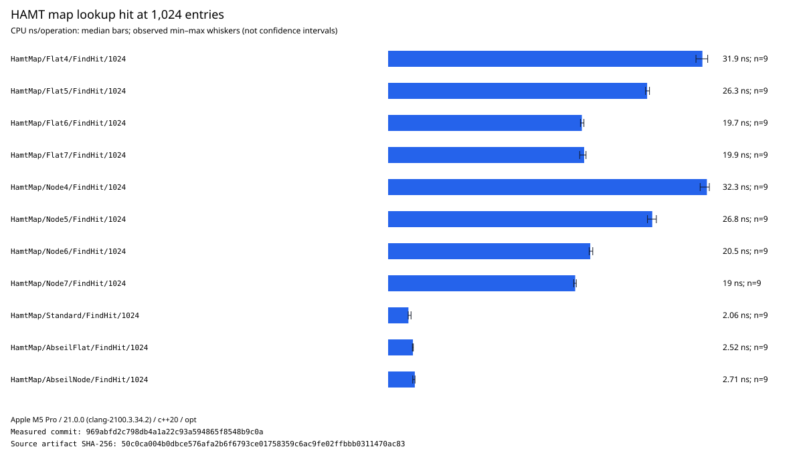
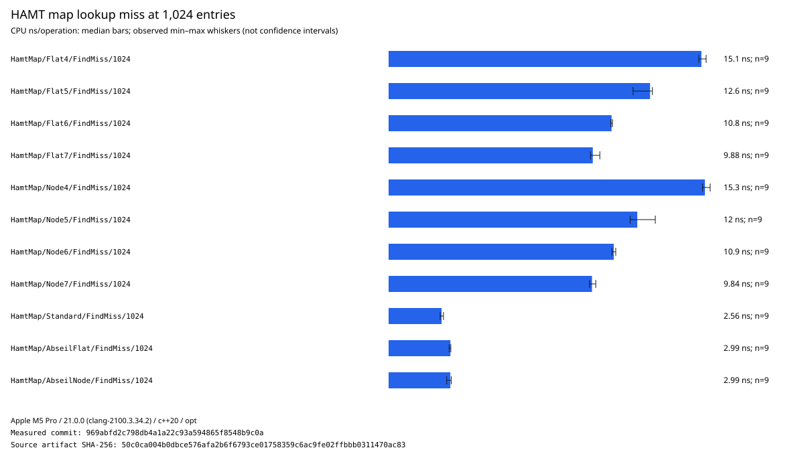
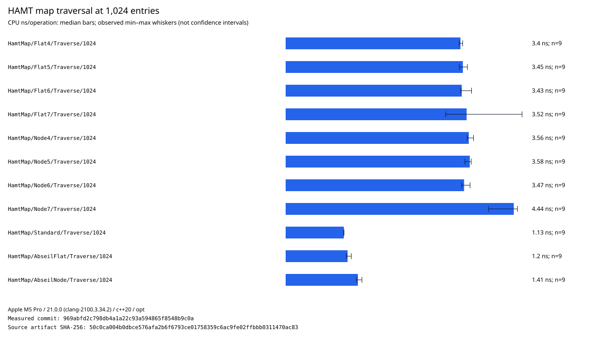
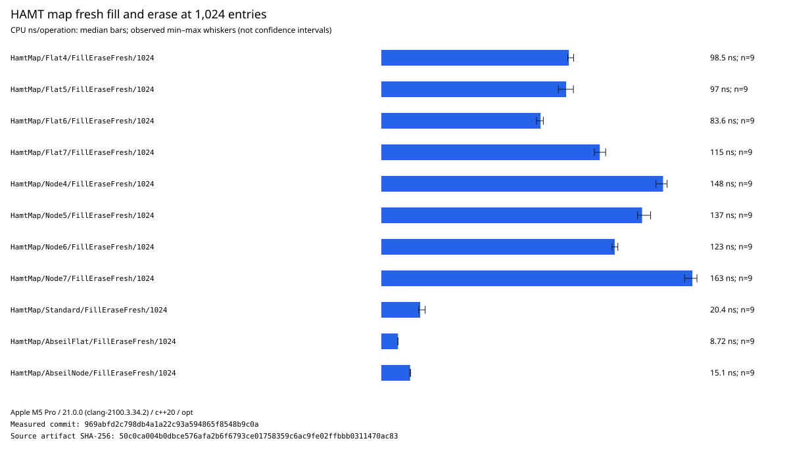
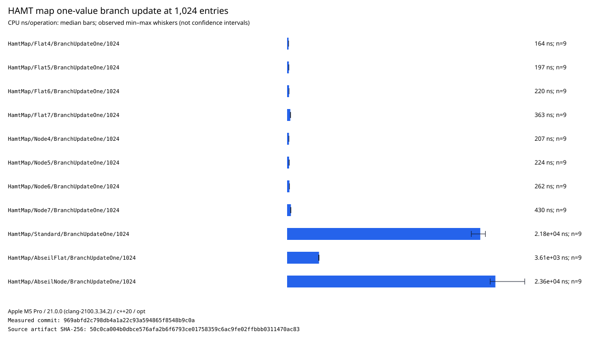
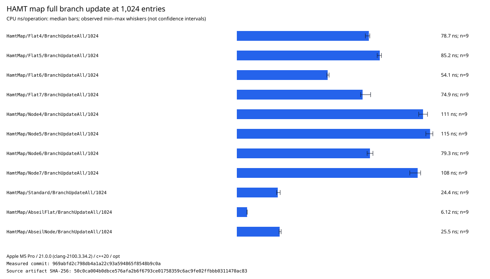
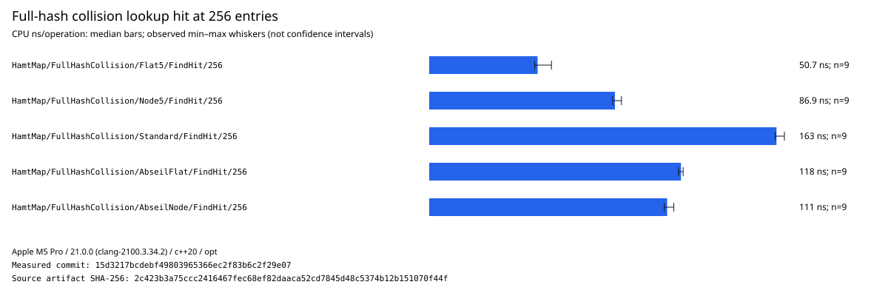
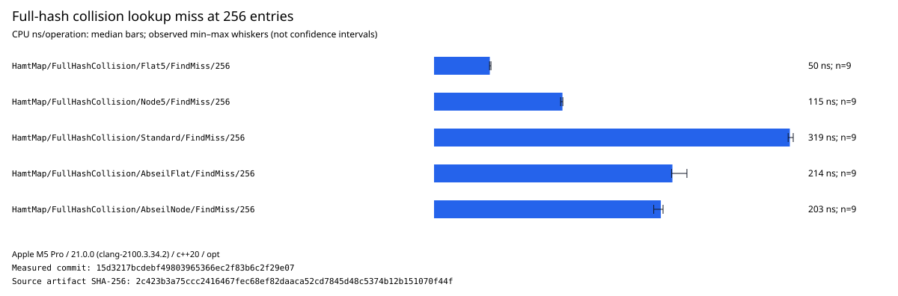
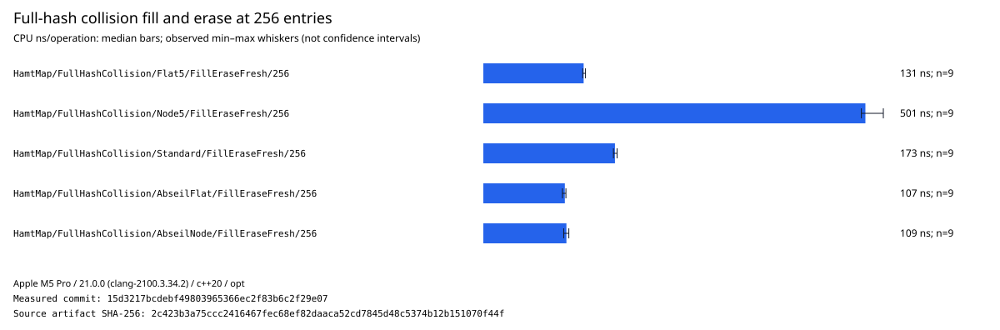

# HAMT measurements

This report records the initial-host evidence for the general `mbo::container` HAMT map
implementation. The semantic and resource contract is specified in
[`HASH_TRIES.md`](../HASH_TRIES.md). These measurements compare ordinary mutable hash tables with
persistent HAMT snapshots; they do not make the containers semantically interchangeable.

The retained artifact was measured from clean commit `969abfd2c798db4a1a22c93a594865f8548b9c0a` on
an Apple M5 Pro with Apple Clang 21, Bazel 9.2, C++20, and an optimized build. It contains nine
randomly interleaved repetitions per case, with a 0.01-second warmup and 0.005-second minimum timed
sample. Bars below show medians and whiskers show the observed minima and maxima, not confidence
intervals. AMD Zen 5 remains a later second-machine measurement before defaults become
cross-architecture recommendations.

## Compared configurations

The benchmark uses the same 64-bit integer hash for every container and compares:

- flat and node HAMTs with 4-, 5-, 6-, and 7-bit hash fragments;
- `std::unordered_map`;
- `absl::flat_hash_map` and `absl::node_hash_map`.

Lookup, traversal, and fresh fill/erase use each container directly. `BranchUpdateOne` and
`BranchUpdateAll` begin with a populated parent and create an independently mutable child. HAMTs
create a transient from a persistent snapshot and copy only paths as they are edited. Conventional
maps copy the complete parent before editing. The parent and child contents are checked before
timing, including snapshot isolation.

## Results at 1,024 entries

For this small integer-key workload, conventional tables are substantially faster for plain
lookup and traversal. Among HAMTs, wider fragments reduce lookup depth: 6- and 7-bit forms are the
fastest lookup candidates on this host. Flat and node lookup are close enough that pointer
stability, payload allocation, and representative key/value shapes remain necessary selection
criteria.

Fresh transient fill and erase also favor conventional mutable hash tables. The 6-bit HAMTs are
the strongest HAMT candidates in this operation; node layout pays its separate payload-allocation
cost. This result does not weaken the HAMT's bounded-allocation, persistent-value, or
non-destructive-failure use cases.

Sparse branch updates reverse the result. Copying and updating a conventional 1,024-entry map costs
roughly 3.6 microseconds for Abseil flat and 22 to 24 microseconds for the standard and Abseil node
maps. HAMT snapshot plus one mapped update costs roughly 164 to 430 nanoseconds, with the flat
4-bit form fastest in this case. This is the central workload for persistent structural sharing.

When every mapped value is changed, structural sharing has no unchanged value paths left to save.
Conventional copies followed by dense mutation win again; the flat 6-bit HAMT is the fastest HAMT
candidate. The crossover must be measured across edit ratios rather than inferred from only the
one-value and all-value endpoints.

## Initial decision matrix

| Requirement or workload                   | Initial choice                              | Reason                                                 |
| ----------------------------------------- | ------------------------------------------- | ------------------------------------------------------ |
| Ordinary mutable integer-key table        | Abseil flat or standard table               | Much faster lookup, traversal, fill, and erase on M5   |
| Sparse persistent branches                | Flat HAMT, initially 4 or 5 fragment bits   | Structural sharing avoids a complete parent copy       |
| General HAMT lookup and bulk mutation     | Measure 6-bit HAMT first                    | Best or near-best HAMT result in these M5 cases        |
| Stable mapped-object addresses            | Node HAMT                                   | Semantic requirement; flat storage cannot provide it   |
| Compact inline payload and locality       | Flat HAMT                                   | Avoids a separately allocated payload node             |
| Provisioned allocation-free operation     | HAMT with bounded control and block sources | Conventional comparison does not provide this contract |
| Recoverable allocation or collision limit | HAMT `try_*` APIs                           | Failure is explicit and leaves the source unchanged    |

This matrix is provisional. Do not select one fragment width solely from these six 1,024-entry
charts. The retained artifact also contains 64- and 16,384-entry cases. Remaining work includes
edit-ratio crossover sweeps, source and payload memory accounting, caller-provisioned allocation
measurements, representative string/key distributions, and AMD Zen 5.

## Adversarial full-hash collisions

A separate clean-source artifact uses a constant-zero hash so every unequal key occupies one
terminal full-hash collision bucket. Cases use 16, 64, and 256 entries; the charts show 256. This is
an intentionally adversarial equality-scan measurement, not a representative hash distribution.
Fragment width cannot change a shared full hash, so this matrix uses the default 5-bit flat and
node HAMTs.

The flat HAMT collision array is fastest for both successful and unsuccessful lookup at 256 entries
on this host. Its roughly 50 ns per queried key is less than half the conventional node/flat Abseil
cost and far below `std::unordered_map`. The node HAMT retains its pointer-stability semantics but
pays pointer-indirection and separately allocated payload costs. All cases remain linear in the
collision-bucket size; a hard-real-time profile must set `maximum_collision_size` rather than
mistaking a favorable constant factor for bounded work.

Abseil flat and node tables are fastest for fresh collision-heavy fill and erase. The flat HAMT is
competitive and faster than `std::unordered_map`, while the node HAMT is substantially slower.
This strengthens the reason to expose flat and node semantics separately and to recommend node
layout only when stable payload addresses justify its cost.
