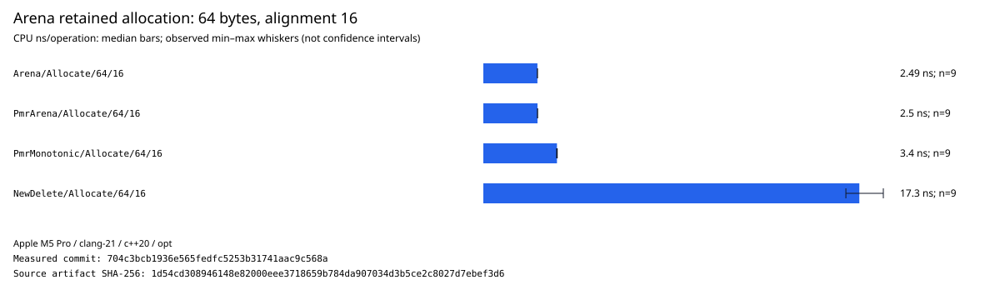
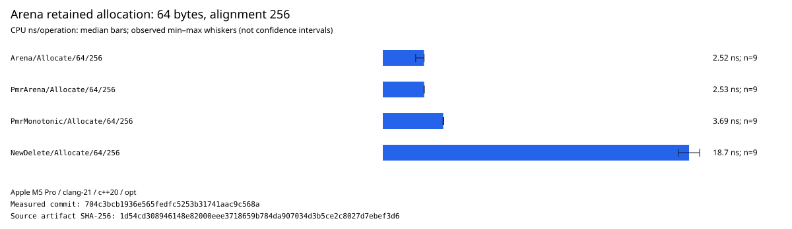
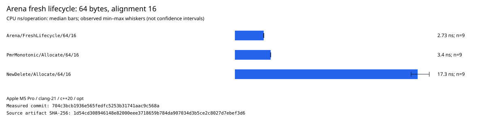

# mbo/memory measurements

This directory contains the raw, attributable evidence used to select and tune `mbo::memory::Arena`.
The methodology inherits the repository-wide artifact contract in
[`INTERNING_IMPLEMENTATION.md`](../../strings/INTERNING_IMPLEMENTATION.md) and the statistical
precautions established by [`mbo/hash/measurements`](../../hash/measurements/README.md).

Arena results are not publication decoration. They decide block growth, descriptor layout,
retention, and default source choices. The Apple M5 Pro provides the initial implementation report.
AMD Zen 5 is a later second-machine follow-up; until then, every performance conclusion is
explicitly provisional and not a cross-architecture recommendation.

## Layout

```text
mbo/memory/measurements/
  README.md
  data/
    <machine>_<compiler>_<git-sha>_arena.json
```

Files under `data/` are immutable JSON envelopes produced by
[`tools/benchmark_artifact.py`](../../../tools/benchmark_artifact.py). The envelope contains the
unaltered Google Benchmark context and rows plus source, host, toolchain, command, timing, load, and
protocol provenance. Do not hand-edit results or replace raw repetitions with a Markdown summary.

## Reference commands

Run from a clean checkout of the exact implementation commit after dependencies have already been
downloaded and built. The output filename is descriptive only; metadata inside the file is
authoritative.

Apple M5 Pro:

```sh
python3 tools/benchmark_artifact.py run \
  --component Arena \
  --target //mbo/memory:arena_benchmark \
  --output mbo/memory/measurements/data/macos-arm64-apple-m5-pro_clang-22_<sha>_arena.json \
  --config clang \
  --config opt_apple_m5 \
  --baseline-commit <parent-sha> \
  -- bazel run //mbo/memory:arena_benchmark --config=clang --config=opt_apple_m5 -c opt --
```

AMD Zen 5:

```sh
python3 tools/benchmark_artifact.py run \
  --component Arena \
  --target //mbo/memory:arena_benchmark \
  --output mbo/memory/measurements/data/linux-x86-64-amd-ryzen-9-9950x_clang-22_<sha>_arena.json \
  --config clang \
  --config opt_zen5 \
  --baseline-commit <parent-sha> \
  -- bazel run //mbo/memory:arena_benchmark --config=clang --config=opt_zen5 -c opt --
```

Use nine repetitions, random interleaving, a nonzero warmup, and a sufficient minimum sample time.
Record the exact controls in the artifact. The initial report uses a 0.01-second warmup and
0.005-second minimum, matching the other initial-host component reports; every raw sample and its
observed range remain available for noise review. A one-repetition smoke run is never measurement
evidence.

Validate every artifact:

```sh
python3 tools/benchmark_artifact.py validate mbo/memory/measurements/data/*.json
```

## Required experiment matrix

| Dimension       | Required cases                                                                  |
| --------------- | ------------------------------------------------------------------------------- |
| Allocation size | 8, 16, 32, 64, 256, 1,024, and 4,096 bytes plus mixed string-like distributions |
| Alignment       | 8, 16, 64, 256, `max_align_t`, and unsupported alignment failure                |
| Source          | New/delete, standard allocator adapter, PMR adapter, fixed external, and inline |
| Growth          | Fixed, repeated, listed, geometric, and dedicated oversized blocks              |
| Lifecycle       | Fresh allocation, retained allocation, reset, release, and reuse                |
| Representation  | Intrusive block headers and every serious pointer/offset alternative            |
| Baseline        | Direct new/delete and `std::pmr::monotonic_buffer_resource`                     |
| Failure         | Source exhaustion, maximum alignment, arithmetic limit, and hard/try APIs       |
| Memory          | Used/reserved bytes, blocks, padding, fragmentation, and peak memory            |

## Review method

Compare matched benchmark names from one randomly interleaved run. Retain all repetitions. Headline
summaries use the mean of the fastest three of nine samples, matching the hash methodology, while
also reporting the full minimum, median, and maximum. The immutable raw repetitions remain
available for computing the mean, standard deviation, coefficient of variation, or another
documented statistic without rerunning or silently changing the measurement.

A candidate is selected only after inspecting latency distributions and memory cost together.
Faster allocation does not excuse materially worse fragmentation or an incomplete failure/lifetime
contract. A regression or noisy result remains in the JSON and is explained in the pull request; it
is never removed merely because it complicates the conclusion.

## Evidence status

| Machine      | Compiler       | Implementation SHA | Artifact                                       | Status     |
| ------------ | -------------- | ------------------ | ---------------------------------------------- | ---------- |
| Apple M5 Pro | Apple Clang 21 | `704c3bcb1`        | `macos-arm64-apple-m5-pro_clang-21_arena.json` | Validated  |
| AMD Zen 5    | Clang and GCC  | pending            | pending                                        | Later work |

This table is updated only from validated JSON. The JSON remains the source of truth.

## Initial Apple M5 Pro results

The charts normalize each 1,024-allocation batch to CPU nanoseconds per allocation. Bars show the
median of nine randomly interleaved observations; whiskers show the observed minimum and maximum,
not confidence intervals. The JSON summaries beside the charts also retain the established
best-three-of-nine mean.



With 16-byte alignment, the default Arena and its PMR-source composition both take approximately
2.5 ns per retained allocation. `std::pmr::monotonic_buffer_resource` takes approximately 3.4 ns,
and direct aligned new/delete takes approximately 17.3 ns. The Arena cases reset and reuse their
retained blocks between batches; direct new/delete creates and destroys every allocation.



The same ordering holds at 256-byte alignment. Padding and reserved-byte counters in the raw
artifact remain part of the decision: latency alone is not permission to ignore alignment waste.



Constructing and destroying a fresh Arena around each 1,024-allocation batch costs approximately
2.7 ns per allocation on this host. That remains below the PMR monotonic and direct new/delete
baselines. This benchmark measures region lifecycle, not arbitrary individual reclamation.

The initial evidence supports Arena as the string-storage and bounded-source substrate. It does not
yet select every growth or descriptor layout. Listed/repeated/geometric growth, offset descriptors,
reuse/retention distributions, caller-owned bounded sources, and detailed peak-memory comparisons
remain separate experiments, as does AMD Zen 5 validation.
