# StringInterner measurements

This report compares representative `StringInterner` configurations after completing the initial
implementation stack. It is deliberately narrower than the complete benchmark harness documented
in [`../STRING_INTERNER_BENCHMARKS.md`](../STRING_INTERNER_BENCHMARKS.md): these retained runs
establish an initial Apple M5 Pro decision matrix, not universal winners.

The measurements use 1,024 distinct 64-byte strings without embedded NUL bytes. Every result has
nine randomly interleaved repetitions, a 0.01-second warmup, and a 0.005-second minimum time. The
tables report median CPU nanoseconds per operation. Raw observations, min/max ranges, best-three
means, the exact command, load, toolchain, commit, and content digest remain in the linked artifacts
and summaries. All runs used an optimized C++20 build on an Apple M5 Pro with Apple Clang 21 and
Bazel 9.2. Each artifact records its measured commit; the initial set and map runs used
`6bd5402e4cfa47a66d975bcf70a416f7db76797e` and the cascade run used the synchronized descendant
identified below.

The host could not report `hw.cpufrequency` or set thread affinity. Google Benchmark states that
this affects frequency metadata rather than the measured clock. The repeated, interleaved results
reduce but do not eliminate host noise.

## Set-style interning

The retained core artifact is
[`macos-arm64-apple-m5-pro_clang-21_string-interner-core.json`](data/macos-arm64-apple-m5-pro_clang-21_string-interner-core.json)
(SHA-256 `2e06d1b03c635e221f41d5f1f5edb188eafc6edd3d33145b8f45ebd3bf0c34d2`).

### Unique lifecycle

This includes construction, 1,024 unique insertions, and destruction.

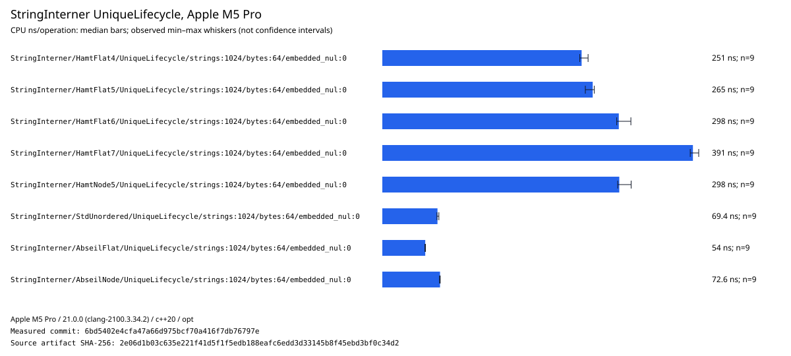

| Index configuration | Median ns/op | Best-three ns/op | Observed minimum | Observed maximum |
| ------------------- | -----------: | ---------------: | ---------------: | ---------------: |
| Abseil flat         |       54.034 |           53.747 |           53.588 |           54.334 |
| Abseil node         |       72.633 |           72.087 |           71.982 |           72.896 |
| `std::unordered`    |       69.426 |           68.834 |           68.788 |           71.189 |
| HAMT flat, 4-bit    |      250.868 |          248.939 |          248.553 |          259.006 |
| HAMT flat, 5-bit    |      264.836 |          259.290 |          255.559 |          266.864 |
| HAMT flat, 6-bit    |      297.682 |          295.361 |          295.092 |          312.882 |
| HAMT flat, 7-bit    |      390.970 |          388.212 |          387.580 |          398.265 |
| HAMT node, 5-bit    |      298.270 |          296.984 |          296.317 |          313.198 |

### Duplicate insertion

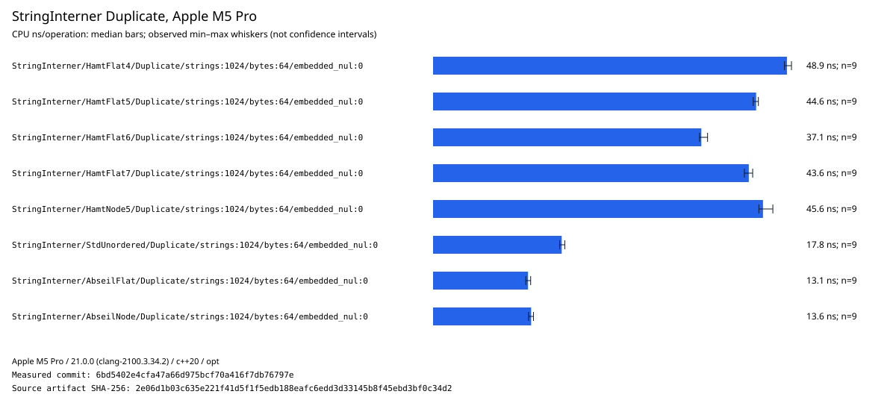

| Index configuration | Median ns/op | Best-three ns/op | Observed minimum | Observed maximum |
| ------------------- | -----------: | ---------------: | ---------------: | ---------------: |
| Abseil flat         |       13.121 |           12.873 |           12.816 |           13.489 |
| Abseil node         |       13.554 |           13.280 |           13.200 |           13.874 |
| `std::unordered`    |       17.779 |           17.510 |           17.492 |           18.207 |
| HAMT flat, 4-bit    |       48.906 |           48.747 |           48.564 |           49.531 |
| HAMT flat, 5-bit    |       44.649 |           44.341 |           44.243 |           44.960 |
| HAMT flat, 6-bit    |       37.071 |           36.867 |           36.822 |           37.939 |
| HAMT flat, 7-bit    |       43.634 |           43.303 |           43.025 |           44.169 |
| HAMT node, 5-bit    |       45.594 |           45.144 |           45.025 |           46.959 |

### Local hit and miss

Depth one makes the local lookup a single-index lookup without ancestor traversal.

| Index configuration | Local hit ns/op | Miss ns/op |
| ------------------- | --------------: | ---------: |
| Abseil flat         |          12.282 |      8.978 |
| Abseil node         |          12.621 |      8.928 |
| `std::unordered`    |          16.191 |     15.296 |
| HAMT flat, 4-bit    |          47.136 |     27.297 |
| HAMT flat, 5-bit    |          42.931 |     26.693 |
| HAMT flat, 6-bit    |          35.846 |     19.884 |
| HAMT flat, 7-bit    |          42.118 |     19.696 |
| HAMT node, 5-bit    |          43.595 |     28.039 |

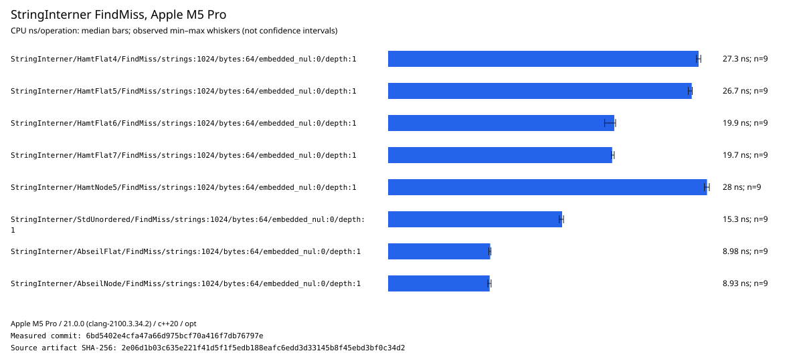

### Dense-ID iteration

Iteration reads stable `string_view` descriptors in dense-ID order. The index does not participate
in the timed traversal, which is why all configurations are effectively tied on this host.

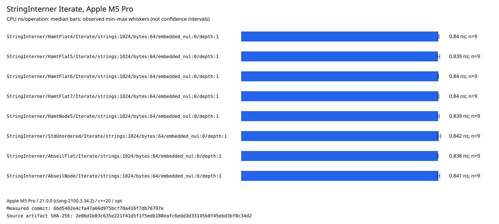

| Index configuration | Median ns/string |
| ------------------- | ---------------: |
| Abseil flat         |            0.838 |
| Abseil node         |            0.841 |
| `std::unordered`    |            0.842 |
| HAMT flat, 4-bit    |            0.840 |
| HAMT flat, 5-bit    |            0.839 |
| HAMT flat, 6-bit    |            0.840 |
| HAMT flat, 7-bit    |            0.840 |
| HAMT node, 5-bit    |            0.839 |

## String length and embedded NUL bytes

The retained input-shape artifact is
[`macos-arm64-apple-m5-pro_clang-21_string-interner-input-shapes.json`](data/macos-arm64-apple-m5-pro_clang-21_string-interner-input-shapes.json)
(SHA-256 `cfc572e77ff218c997418bb95eb667d878eead350c3a5692e49f31ed812a3d41`).
It measures 64 and 1,024 strings, 16- and 512-byte payloads, embedded-NUL and ordinary byte strings,
and lifecycle, duplicate, and local lookup paths at commit
`f645e745f81248dfae7742e3cf52fe9fe76857f7`. The chart shows the 1,024-string lifecycle cases.

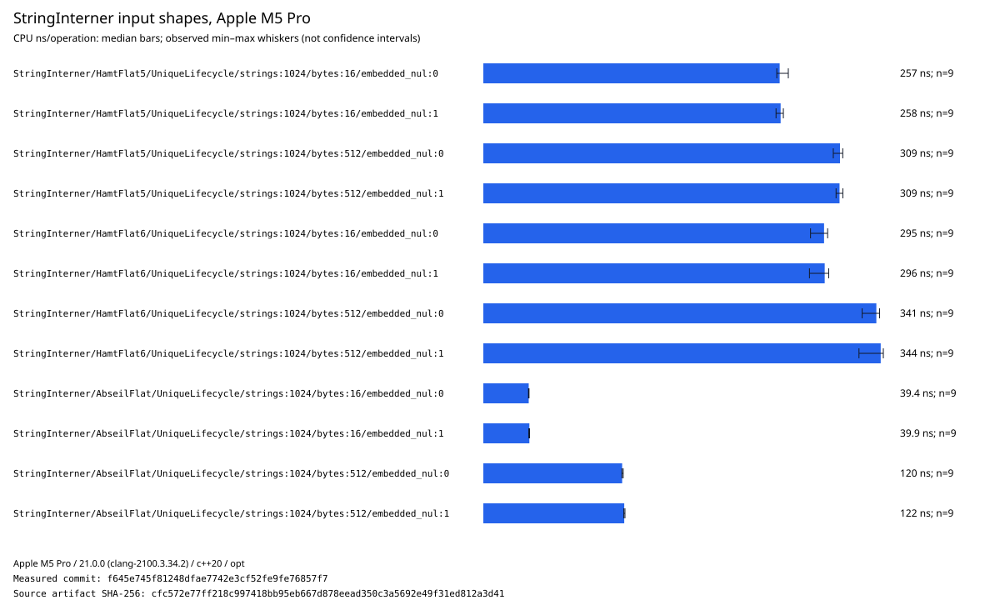

| Index configuration | 16 bytes | 16 bytes + NUL | 512 bytes | 512 bytes + NUL |
| ------------------- | -------: | -------------: | --------: | --------------: |
| Abseil flat         |   39.350 |         39.920 |   120.326 |         122.140 |
| HAMT flat, 5-bit    |  256.872 |        257.700 |   309.171 |         308.771 |
| HAMT flat, 6-bit    |  295.346 |        295.898 |   340.674 |         344.448 |

Values are median CPU nanoseconds per inserted string for construction, unique insertion, and
destruction. Longer strings increase hashing and copying work. Embedded NUL bytes show no relevant
microbenchmark penalty, so supporting full `string_view` byte semantics needs no policy switch.

## ID width, folded hash width, and the empty string

The retained width/empty artifact is
[`macos-arm64-apple-m5-pro_clang-21_string-interner-id-hash-empty.json`](data/macos-arm64-apple-m5-pro_clang-21_string-interner-id-hash-empty.json)
(SHA-256 `be06c57b39509158406c31a655003498bb46cf2b84c1c65d1cac7aaaaf7546f1`).
It measures the independent ID-width and hash-width dimensions at commit
`f645e745f81248dfae7742e3cf52fe9fe76857f7`.

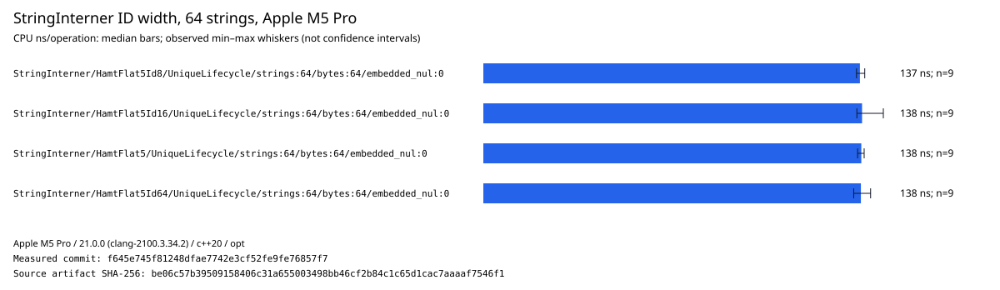

| ID width | Unique lifecycle ns/string |
| -------: | -------------------------: |
|        8 |                    137.426 |
|       16 |                    138.212 |
|       32 |                    137.936 |
|       64 |                    137.782 |

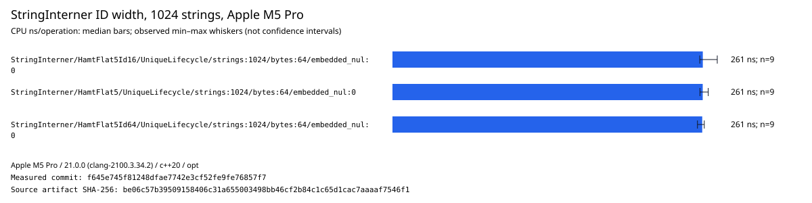

| ID width | Unique lifecycle ns/string |
| -------: | -------------------------: |
|       16 |                    261.230 |
|       32 |                    261.155 |
|       64 |                    260.742 |

ID width does not measurably control lifecycle speed in these cases. Keep 32 bits as the general
default because it balances descriptor size and cardinality; select 8 or 16 bits for deliberately
bounded populations and 64 bits only when the larger identifier space is actually required.

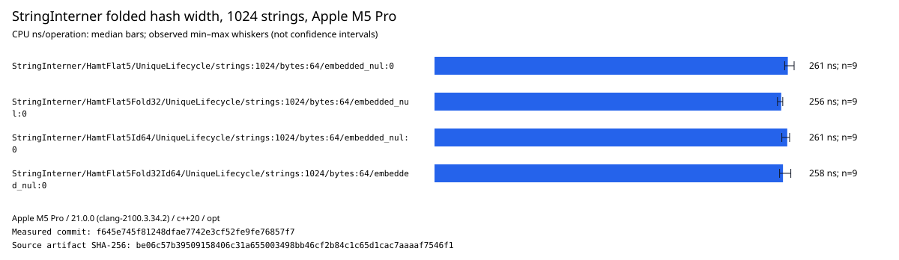

| ID width | Hash result | Unique lifecycle ns/string |
| -------: | ----------: | -------------------------: |
|       32 |     64 bits |                    261.155 |
|       32 |     32 bits |                    256.257 |
|       64 |     64 bits |                    260.742 |
|       64 |     32 bits |                    257.587 |

The 32-bit result is an XOR fold of the same 64-bit hash, not a native 32-bit hash algorithm. Its
small M5 lifecycle advantage does not establish collision quality or a general default. The result
also confirms that hash width and ID width are independent configuration dimensions.

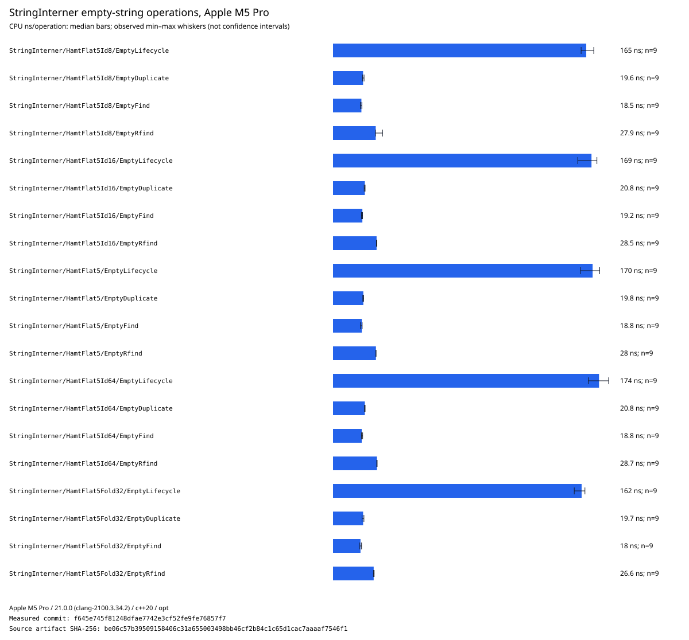

Empty strings retain ordinary dense-ID semantics: ID zero is a successful value, duplicates return
that ID, and both search directions find it. The benchmark preflight verifies that storing it
reserves no character bytes. The container and index still have control/storage costs, so this is
not a claim that the entire empty-string operation allocates nothing.

## Character and descriptor storage profiles

The retained storage artifact is
[`macos-arm64-apple-m5-pro_clang-21_string-interner-storage.json`](data/macos-arm64-apple-m5-pro_clang-21_string-interner-storage.json)
(SHA-256 `0c3c1d4710b9d43f15299ada1224e19ec39e338f8f82998dd0ee30ecc7c5b560`).
It varies initial arena block size and descriptor segment capacity independently at commit
`f645e745f81248dfae7742e3cf52fe9fe76857f7`.

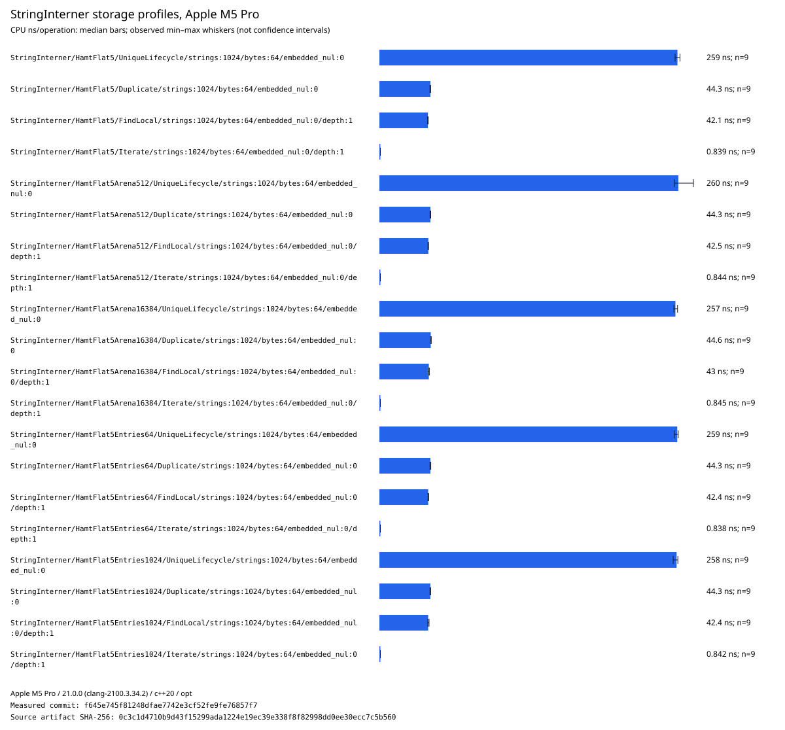

| Storage profile     | Lifecycle | Duplicate | Local find | Iterate | Character reserved | Descriptor directory |
| ------------------- | --------: | --------: | ---------: | ------: | -----------------: | -------------------: |
| Default             |   258.939 |    44.307 |     42.123 |   0.839 |            126,976 |                  224 |
| Arena 512           |   259.728 |    44.326 |     42.508 |   0.844 |            130,560 |                  224 |
| Arena 16,384        |   257.161 |    44.601 |     42.950 |   0.845 |            114,688 |                  224 |
| 64-entry segments   |   258.752 |    44.275 |     42.352 |   0.838 |            126,976 |                  896 |
| 1,024-entry segment |   258.188 |    44.269 |     42.350 |   0.842 |            126,976 |                   56 |

Times are median CPU nanoseconds per operation; reservation columns are bytes for the populated
1,024-string lookup fixture. Hot-path timing is effectively tied. A 16,384-byte initial character
block reduces reserved bytes for this exact 64-byte distribution, while a 512-byte block increases
growth overhead. A 1,024-entry descriptor segment minimizes directory bytes at this cardinality;
64-entry segments pay more directory memory. These fixed-shape results support keeping the current
balanced defaults and exposing the options, not globally selecting the largest blocks.

## Bounded-capacity failure

The retained capacity artifact is
[`macos-arm64-apple-m5-pro_clang-21_string-interner-capacity.json`](data/macos-arm64-apple-m5-pro_clang-21_string-interner-capacity.json)
(SHA-256 `4b33b597e08e723e1efa2ac83bd859791f8dfad7a7d145a39d77bbaa9cf7fb94`).
It measures one attempted operation against saturated ID, descriptor, character, or index storage
at commit `f645e745f81248dfae7742e3cf52fe9fe76857f7`.

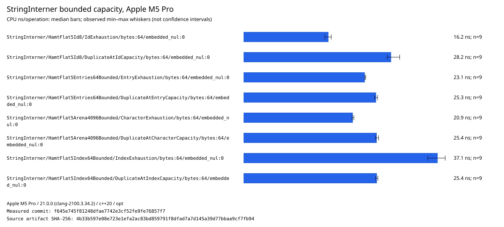

| Bound      | Exhausted insertion ns | Duplicate-at-capacity ns |
| ---------- | ---------------------: | -----------------------: |
| ID         |                 16.200 |                   28.161 |
| Descriptor |                 23.147 |                   25.299 |
| Character  |                 20.856 |                   25.418 |
| Index      |                 37.052 |                   25.449 |

Each fixture performs untimed preflight and post-timing validation of the specific error,
unchanged size, unchanged committed character bytes, and the exact duplicate ID. Exhaustion is a
normal recoverable result rather than an exception path. Duplicate lookup remains successful at
capacity because it needs no new ID, descriptor, character bytes, or index entry.

## Cascading lookup direction and distribution

The retained cascade artifact is
[`macos-arm64-apple-m5-pro_clang-21_string-interner-cascades.json`](data/macos-arm64-apple-m5-pro_clang-21_string-interner-cascades.json)
(SHA-256 `708e4e4cdaf446fa769248dbdd6b035bee36020f30104a38b7a370586c124537`).
It measures depths 2, 8, and 32 at commit `f645e745f81248dfae7742e3cf52fe9fe76857f7`.
The rendered comparisons use depth 8, where each level owns 128 of the 1,024 visible strings.
Queries are constructed and shuffled outside timing with the documented fixed seed.

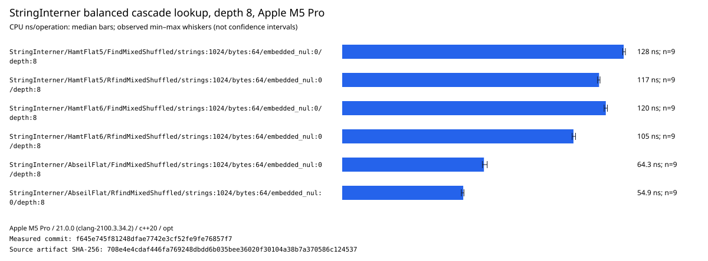

| Index configuration | Forward mixed ns/op | Reverse mixed ns/op |
| ------------------- | ------------------: | ------------------: |
| Abseil flat         |              64.319 |              54.920 |
| HAMT flat, 5-bit    |             127.732 |             116.557 |
| HAMT flat, 6-bit    |             119.620 |             104.949 |

Balanced mixed batches contain equal root hits, leaf hits, and misses. Direction matters because
`find` starts at the root while `rfind` starts at the leaf.

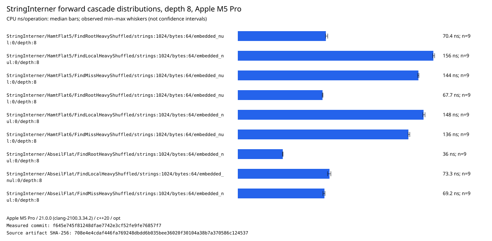

| Index configuration | Root-heavy | Local-heavy | Miss-heavy |
| ------------------- | ---------: | ----------: | ---------: |
| Abseil flat         |     35.963 |      73.269 |     69.231 |
| HAMT flat, 5-bit    |     70.383 |     156.272 |    144.326 |
| HAMT flat, 6-bit    |     67.705 |     148.437 |    136.328 |

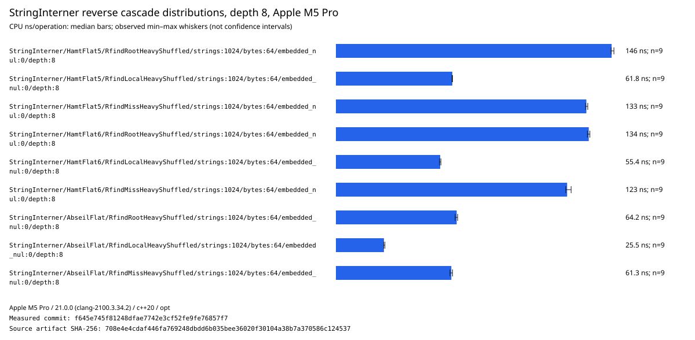

| Index configuration | Root-heavy | Local-heavy | Miss-heavy |
| ------------------- | ---------: | ----------: | ---------: |
| Abseil flat         |     64.154 |      25.511 |     61.324 |
| HAMT flat, 5-bit    |    146.474 |      61.833 |    133.060 |
| HAMT flat, 6-bit    |    134.337 |      55.412 |    122.830 |

The direction results validate offering both search orders: forward lookup is best for root-heavy
traffic, while reverse lookup is best for local-heavy traffic. Neither parent nor child can be
declared universally hotter. Six-bit fragments remain consistently faster than five-bit HAMT in
these M5 cascade cases, but Abseil flat remains faster when its allocation and persistence
semantics are acceptable.

## Map composition

The retained map artifact is
[`macos-arm64-apple-m5-pro_clang-21_string-interner-map.json`](data/macos-arm64-apple-m5-pro_clang-21_string-interner-map.json)
(SHA-256 `a43eb15320564a8369363cd65d194ab6ac50581582e675d2c9b828d3123a84be`).
It adds a `uint64_t` value per dense ID without charging set-only interning for mapped storage.

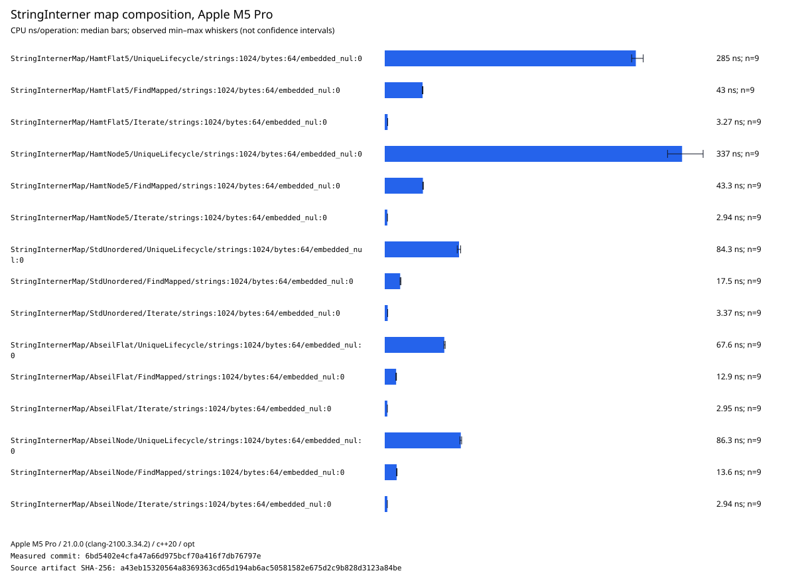

| Index configuration | Unique lifecycle | Find mapped | Iterate key/value |
| ------------------- | ---------------: | ----------: | ----------------: |
| Abseil flat         |           67.598 |      12.933 |             2.946 |
| Abseil node         |           86.308 |      13.551 |             2.942 |
| `std::unordered`    |           84.302 |      17.536 |             3.375 |
| HAMT flat, 5-bit    |          284.871 |      42.950 |             3.266 |
| HAMT node, 5-bit    |          337.354 |      43.330 |             2.935 |

Values are median CPU nanoseconds per operation. Unique lifecycle includes mapped construction and
destruction. Find mapped includes content lookup followed by dense-ID value resolution. Iteration
reads both the key view and mapped value.

## Provisional configuration matrix

The index is an explicit configuration dimension because no representation dominates all required
semantics. This matrix records the current choice, not a permanent default decision.

| Requirement                                      | Provisional choice       | Reason                                                                                 |
| ------------------------------------------------ | ------------------------ | -------------------------------------------------------------------------------------- |
| Fastest ordinary single-owner insertion/lookup   | Abseil flat adapter      | Clear M5 lead for lifecycle, duplicate insertion, and lookup                           |
| Standard-library-only integration                | `std::unordered` adapter | Portable fallback; slower than Abseil flat here but faster than HAMT hot paths         |
| Bounded, recoverable, caller-provisioned storage | Flat HAMT                | Supports maximum size, arena/block sources, detailed exhaustion, and strong rollback   |
| Persistent snapshots and cheap child branching   | Flat HAMT                | Structural sharing supplies semantics unavailable from ordinary mutable hash tables    |
| Stable indexed iteration                         | Any supported index      | Dense descriptor storage, not the index, determines iteration and pointer stability    |
| Stable mapped addresses                          | Node-backed composition  | Select node semantics explicitly when mapped-address stability is required             |
| Initial HAMT fragment width                      | 6-bit candidate          | Best measured HAMT hits/duplicates; 7-bit slightly improves misses but costs lifecycle |
| Conservative HAMT baseline                       | 5-bit                    | Retain until memory, deep-chain, collision, and Zen 5 evidence justifies changing it   |

The M5 results strongly reject treating HAMT as the universally fastest local mutable hash table.
They do not reject it for the capabilities that motivated it: bounded no-heap operation,
recoverable exhaustion, persistence, arena-backed storage, and pointer-stable node composition.
The default must therefore remain driven by required guarantees as well as speed. A 6-bit flat
HAMT is a measured performance candidate, not yet a default change: its node size, memory use,
collision behavior, and AMD Zen 5 results still need comparison.

## Remaining measurement work

- Run the same retained matrices on AMD Zen 5 before finalizing fragment width or defaults.
- Compare fully caller-provisioned control storage and report allocation counts and peak memory.
- Retain representative mbo/xff/proto string-size and duplication distributions.
- Add collision-heavy and persistent-branching comparisons for the general HAMT containers.

Those follow-ups may change performance recommendations, but they do not weaken the implemented
lifetime, dense-ID, rollback, pointer-stability, or allocation guarantees.
